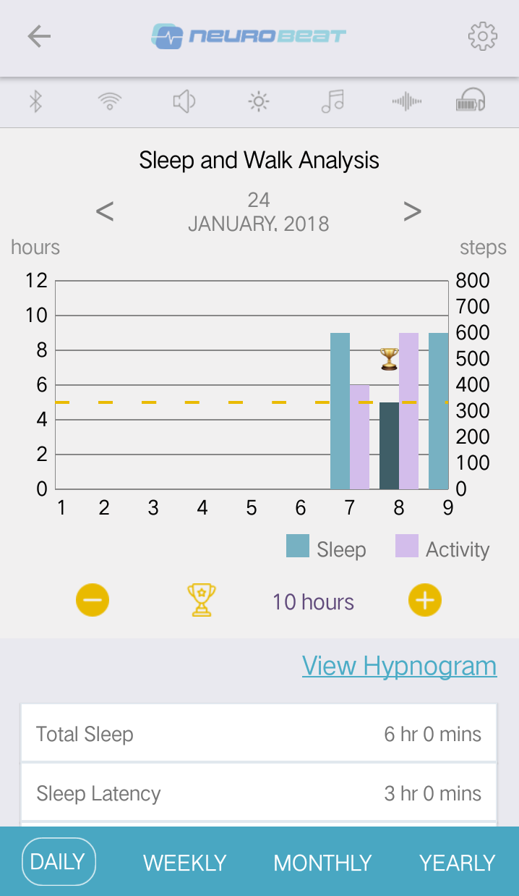
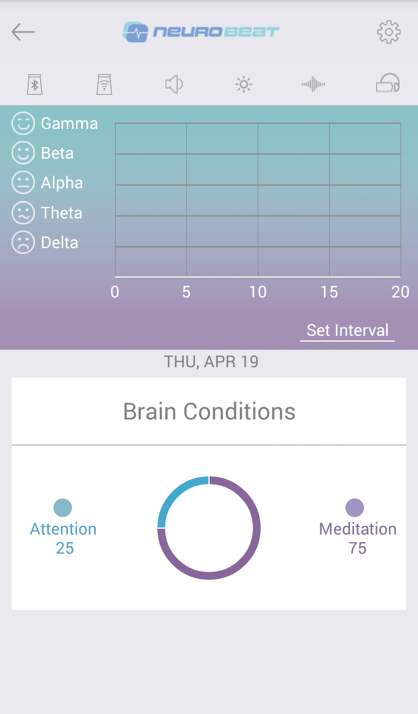
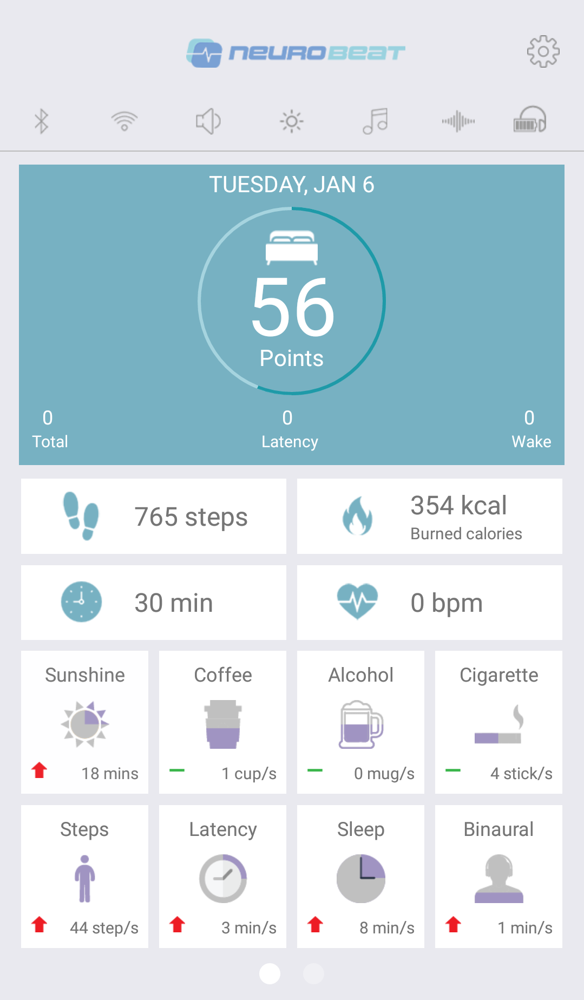
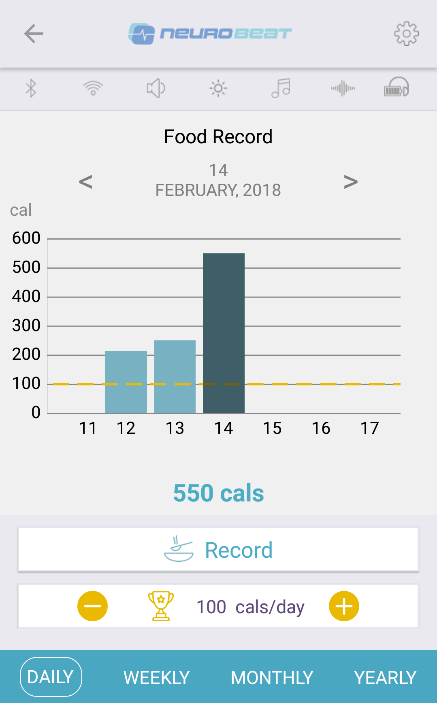

### Healthcare mobile application 

*Description*:

An React Native application running in both Android and iOS platform. Mobile communicate with external devices (station, headset) via Bluetooth (BLE and SPP) to tracking and record health data.

Following are the major features of application:
* Registration and authentication (Support OAuth2)
* Multi-languages support (English, Korean)
* Dashboard view to display summary data
* Setting application (Wifi, Bluetooth, Display, Music)
* Food, Water, Caffeine, Alcohol, Cigarette record
* Activities tracking (Sleep and Walking)
* Brain waves displaying
* Alarm Settings and Notification

*Technology stack*
* Front-end: `React Native`, Native libraries in iOS, Android
* Back-end: AWS, Flask, Couchbase server

*Project development methodology*
* Agile / Scrum

### IoT Trunknet application
