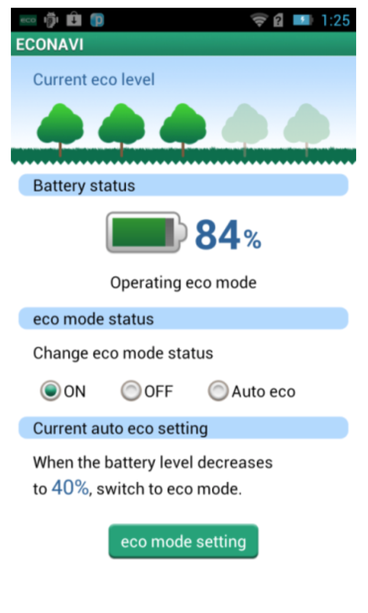
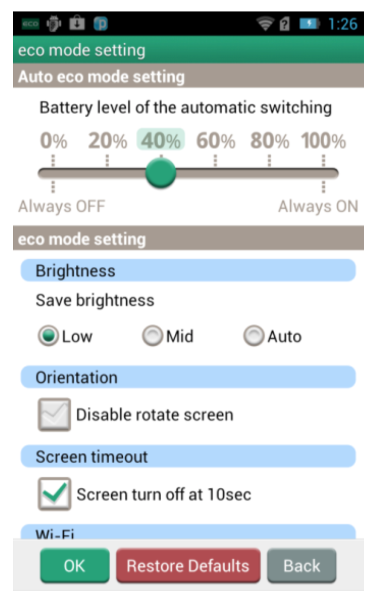

### Healthcare mobile application 

> An React Native application running in both Android and iOS platform. Mobile communicate with external devices (station, headset) via Bluetooth (BLE and SPP) to tracking and record health data.

**Features**

* Registration and authentication (Support OAuth2)
* Multi-languages support (English, Korean)
* Dashboard view to display summary data
* Setting application (Wifi, Bluetooth, Display, Music)
* Food, Water, Caffeine, Alcohol, Cigarette record
* Activities tracking (Sleep and Walking)
* Brain waves displaying
* Alarm Settings and Notification

**Screenshot**

**Technology stack**
* Front-end: `React Native`, Native libraries in iOS, Android
* Back-end: AWS (EC2, SNS, Sync Gateway), Flask PHP, Couchbase server

**Project methodology**
* Agile / Scrum

---

### IoT Trunknet application

> Enables capturing and processing of big volumes of truck data to provide valuable information to the customers. Its services are bundled into groups that provide the customer insights into their fleet’s performance and health

**Features**

* Track and Trace: Trip history, trip duration, trucks’ current positions on the map. Display of routes and stops
* Safety: Unsafe events detailed information breakdown into daily values and over distance (i.e,. harsh brake, or acceleration events per 100 km)
* Fuel & Energy Efficiency: Truck’s fuel / energy efficiency of current and previous month in list view
* Fleet Management: Breakdown per truck regarding running time, idling time and distance covered
* Maintenance Alerts: Reports/Notifications regarding problems of the trucks

**Screenshot**

**Technology stack**

* Front-end: JavaScript ES6, React 15.6, Redux, Webpack
* Back-end: Java 8, Spring boot, MySQL, GrapQL, Azure cloud techs
* Testing: Mocha, Chai (Unit Testing), Enzynme (React UI), Selenium (Automation testing)
* CI/CD: Visual Studio Team Service

**Project methodology**
* Agile / Scrum

---

##Econavi App

> Application monitors and optimize Panasonic Android mobile’s energy con- sumption by learning from the gathered sensor data, battery level. It then adjusts to the optimal energy-efficiency setting (brightness, connection, time- out)

**Feature**

* Creating application widget to display critical information
* Provide setting configuration to switch between Normal and Eco mode to
reduce battery consumption automatically or manually
* Support multi-language features
* Creating new UI application when running in tablet device

*Note:* This is a system application (or built-in application). It means that application is delivered with specified mobile type of a specific manufacture since it can involve native api to get data from sensor or control battery mechanism of mobile app.

**Screenshot**

**Project methodology**
* Waterfall with short-cycle due to the short duration of making new mobile model.