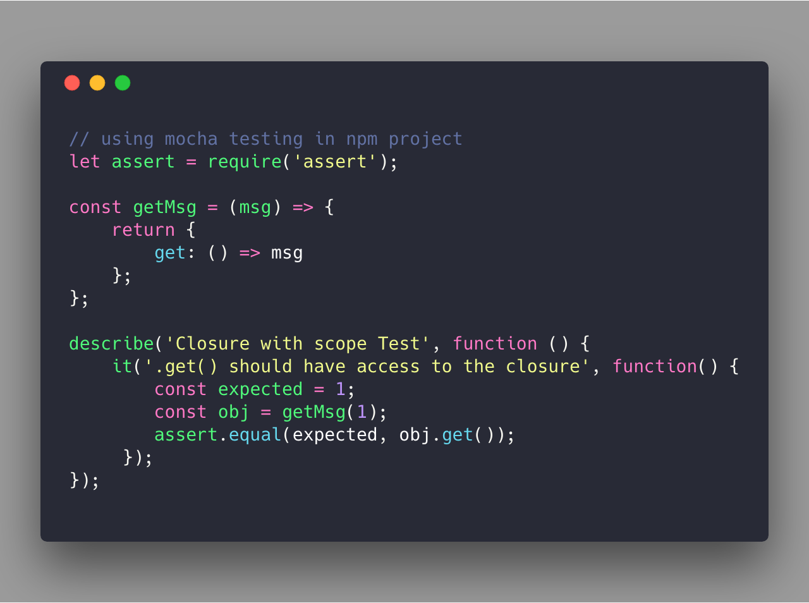
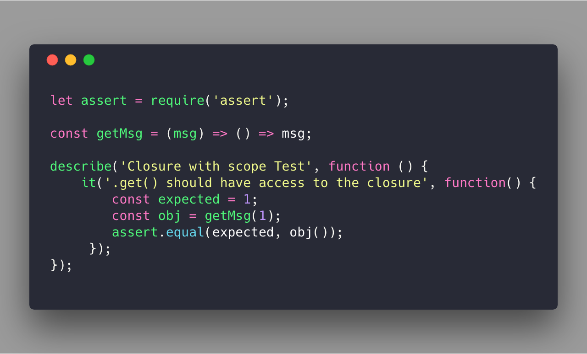

> Closure is the combination of a function with the references to its surrounding environment state (scientific term, `lexical environment`). It is a common way to give the object data privacy. It lets the inner function to be able to access its local scope, parent scope (even after parent function has closed) and global scope (`scope chain`)  

For example:

In that example `.get()` function is defined within scope of its parent (outer) function `getSecret()`, so that it can be able to access the variable `msg` even when parent function finished running. 

There is a better way to re-write example with `stateful function` style:

**Conclusion**

Closure is not an easy term that every developer could understand. But it have been used in many other techniques of the programming language (not only privacy data access), but also partical function, curry function (function composing). Understanding Closure will help us to make a better program.