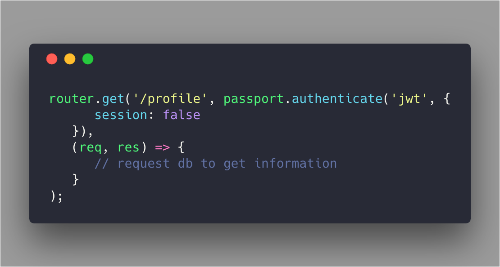
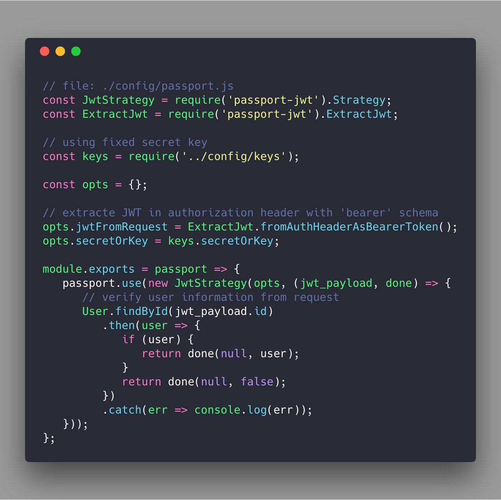
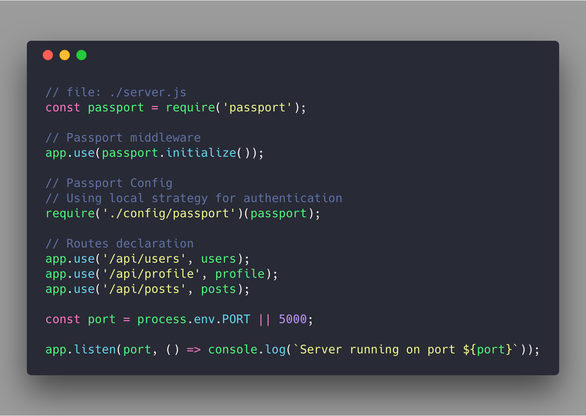

## Definition
> Passportjs is an authentication middleware for Node.js. It include a comprehensive set of strategies (`500 ways`) support authentication using: username/password, Facebook, Twitter and more .  

It is simple to authenticate request with **Passport** by using API `passport.authenticate`, with define which strategy we want to apply. 

For example:



## Authentication with Passport-JWT

**passport-jwt** is  a strategy for authenticating with JSON Web Token [JSON Web Tokens - jwt.io](https://jwt.io/)

### Install 

```sh
$ npm install passport passport-jwt
```

### Configuration

Strategies must be configured prior to using them in a route. The JWT authentication strategy is configure by following structure:

```js
new JwtStrategy(options, verify)
```

`option` is an object literal contains various options to control how the token is extracted from the request or verify. 

Following are some notable options:

	* `secretOrKey`  is a string or buffer contain the secret key (symmetric) or public key (asymmetric) for verity token’s signature. Secret key is fixed with this option.
	
	* `secretOrKeyProvider` this is a callback function that applied when we want to use a dynamic seret key. This option or `secretOrKey` must be provided depending using dynamic or static key.
	
	* `jwtFromRequest`, this option controls how the token is extracted from request. There are several *extractor factory functions*.

For example:



***Note**: Declaration JWT strategy prior to using them in the route



## Closing
In modern web application, authentication can take a variety of form. As a middleware for Node application, Passport recognizes  that requirements, and provides various authentication mechanism (known as strategies), packages each strategy as individual module, apply them depending on the application’s requirements.