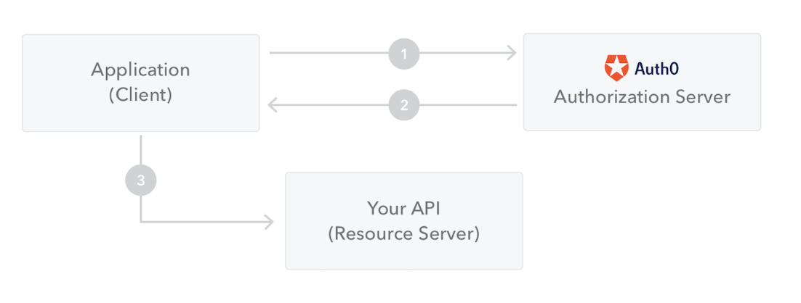
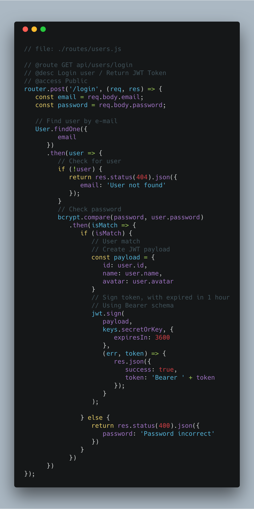

> JSON We bTokens - [JSON Web Tokens - jwt.io](https://jwt.io/) is an open, industry standard RFC 7519 methods for representing 	claims securely between two parties as JSON object.  

## Structure
JSON Web Token consist of three sections separated by the dot (.):

	* Header
	* Payload (`Claims`)
	* Signature

Let go into the details content  of each sections

### Header

The header typically includes two parts: the token type (which is JWT), and the hashing algorithm being used (such as HMAC SHA256 or RSA).

For example:

```js
{
	"alg": "HS256",
	"typ": "JWT"
}
```

Then this header is encoded by `Base64Url` to become another value:

```js
eyJhbGciOiJIUzI1NiIsInR5cCI6IkpXVCJ9
```

### Payload

This section contains the claims. Claims are statements about an entity (for example, user information - id, name, email) and additional data.  

There are three types of claims: *registered, pubic and private claims*. Note that the claims name are only three characters long.

An example of payload including only private claims:

```js
{
   "sub": "1234567890",
   "name": "John Doe",
   "admin": true
}
```

The payload is also Base64Url encoded as same way as header encoding.

### Signature

The signature is used to verify the message wasn’t changed along the way. If signature is signed with a private key, it can also verify the identity of JWT sender.

To create the signature, we take the encoded header and encoded payload, a secret key, and the algorithm specified in the header, and sign that.

```js
HMACSHA256(
  base64UrlEncode(header) + "." +
  base64UrlEncode(payload),
  secret)
```

## How JSON Web Token works



	1. Client login successfully using their credentials. Server return client with a JSON Web Token.
	2. When client request an access to a protected route or resource, client attach JWT in its request
	3. Server extract token from request, involve specific logic to validate it (for example, check database)

Following example using `jsonwebtoken` package for login process and return token when login is successed.



## Application
* Authorisation: once user logged in, each subsequent request will include the JWT token, allowing the user to access routes, services, and resources that are permitted with that token.

* Information Exchange: transmitting information securely between parties. JWT can be signed, using public / private key pair - so receivers can confirm that senders are who they say they are. 

Additionally, the signature is calculated using the header and payload, so receiver can also verify that the content within JWT has not been tampered by others.

## Closing
JSON Web Token is open standard for creating access token. It is compact because of its small size that can be sent through a URL or POST parameters. It is self-contained when including all required information about user. With such advantages, developer can utilize JWT to create truly stateless Web APIs.
