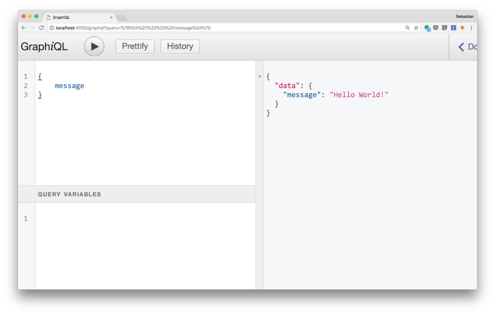

## Section A

> GraphQL is a language that enables us to provide a complete description of the data in your API. It gives client the power to ask for exactly what they need.  

Here are the advantages of GraphQL

* Declarative: query responses are decided by client, not server
* Composition: a query is a hierarchical set of fields. 
* strongly typed: a query can be ensured to be valid with GraphQL type system

In the next section, we will write a simple GraphQL sample that running as a Node.js server to understand more about features of GraphQL:

- Step 1: Create and initial project

Create project folder

`mkdir sample`
`cd sample`

Init the configuration of node project, with entry file is `server.js`

`nom init`  

Create entry file

`touch server.js`

* Step 2: Install necessary NPM package for sample project

`npm install graphql express express-graphql —save`

* Step 3: Create a basic graphql server with express

```javascript
var express = require('express');
var express_graphql = require('express-graphql');
var { buildSchema } = require('graphql');
// GraphQL schema
var schema = buildSchema(`
    type Query {
        message: String
    }
`);
// Root resolver
var root = {
    message: () => 'Hello World!'
};
// Create an express server and a GraphQL endpoint
var app = express();
app.use('/graphql', express_graphql({
    schema: schema,
    rootValue: root,
    graphiql: true
}));
app.listen(4000, () => console.log('Express GraphQL Server Now Running On localhost:4000/graphql'));
```

There are some notes in this step:

1. We have to define schema for GraphQL. 

> The schema  is piece of GraphQL Interface Definition Language which be used to describe the meaning, semantic of the type system  

2. Whenever client makes query, the query is validated against the schema

3. We also have to implement `resolver`, this is a mapping of actions to functions. (In this sample, we have a `message` action)

4. Lastly, we define an endpoint router, `/grapql` with some parameters that we defined in the previous steps.

The `graphical` is set to true when we want to enable GraphiQL tool. This tool is a graphical interactive that allow developer to write directly queries to get data.

* Step 4: Running Node.js application with `node server.js`

Now, we can open web browser and see how to use GraphiQL tool (localhost:4000/graphql)

The query is simple as:

```javascript
{
    message
}
```

Next hitting the **Execute Query** button, and we will see the follow result:


 

We could do some further steps to make a more complicated sample:

* Implement more data structure in schema

Let adding more complicated data structure in the schema definition:

```javascript
// GraphQL schema
var schema = buildSchema(`
    type Query {
        course(id: Int!): Course
        courses(topic: String): [Course]
    },
    type Course {
        id: Int
        title: String
        author: String
        description: String
        topic: String
        url: String
    }
`);
```

In the same file, we adding a mock data source for query support:

```javascript
var coursesData = [
    {
        id: 1,
        title: 'The Complete Node.js Developer Course',
        author: 'Andrew Mead, Rob Percival',
        description: 'Learn Node.js by building real-world applications',
        topic: 'Node.js',
        url: 'https://codingthesmartway.com/courses/nodejs/'
    },
    {
        id: 2,
        title: 'Node.js, Express & MongoDB Dev to Deployment',
        author: 'Brad Traversy',
        description: 'Learn by example building & deploying real-world Node.js applications',
        topic: 'Node.js',
        url: 'https://codingthesmartway.com/courses/nodejs-express-mongodb/'
    },
    {
        id: 3,
        title: 'JavaScript: Understanding The Weird Parts',
        author: 'Anthony Alicea',
        description: 'An advanced JavaScript course for everyone! Scope, closures, prototypes, and more.',
        topic: 'JavaScript',
        url: 'https://codingthesmartway.com/courses/understand-javascript/'
    }
]
```


Once we have a schema and data source, we can define some simples query functions:

```javascript
var getCourse = function(args) { 
    var id = args.id;
    return coursesData.filter(course => {
        return course.id == id;
    })[0];
}
var getCourses = function(args) {
    if (args.topic) {
        var topic = args.topic;
        return coursesData.filter(course => course.topic === topic);
    } else {
        return coursesData;
    }
}
```

It is Important that we have to include the declaration of query functions in the `root` variable.

```javascript
var root = {
    course: getCourse,
    courses: getCourses
};
// Create an express server and a GraphQL endpoint
var app = express();
app.use('/graphql', express_graphql({
    schema: schema,
    rootValue: root,
    graphiql: true
}));
```

Finally, running the node application, and put some interesting query in the window

* Getting a single course

```javascript
{
  course(id: 1) {
    title
    author
  }
}
```

* Getting a course list that have a same title:

```javascript
{
  courses(topic: "Node.js") {
    title,
    author,
    description,
    topic,
    url,
  }
}
```


## Section B - Querying
* Alias

Alias is applied if we want to use query for the same field with different argument. For example, if we want two course item, with id 1 and 2, then we would do:

```javascript
{
  a: course(id: 1) {
    id
    title
  }
  b: course(id: 2) {
    id
    title
  }
}
```

The result return:

```javascript
{
  "data": {
    "a": {
      "id": 2,
      "title": "Node.js, Express & MongoDB Dev to Deployment"
    },
    "b": {
      "id": 1,
      "title": "The Complete Node.js Developer Course"
    }
  }
}
```

* Variables

We have been writing all argument s inside string or number. But in the most application, the query will get dynamic value for the argument. In such case, we have to use `variable` . This is  an example:

```javascript
query giveMeAName($id1: Int!, $id2: Int!) {
  a: course(id: $id1) {
    id
    title
  }
  b: course(id: $id2) {
    id
    title
  }
}

```

We have two arguments `$id1` and `$id2`. In the query variable window, we assign values for those variables in this way:

```javascript
{
  "id1": 1,
  "id2": 2
}
```

We can also assign the default value for an argument (with the condition that the argument is not REQUIRED)

For example:

```javascript
query giveMeAName($id1: Int = 1, $id2: Int!) {
  a: course(id: $id1) {
    id
    title
  }
  b: course(id: $id2) {
    id
    title
  }
}

```

The in the query, the `$id1` can be omitted with default assigned value:

```javascript
{
  "id2": 2
}
```

We even can make the data structure of query more dynamic by using `directive`

```javascript
query giveMeAName($id1: Int = 1, $id2: Int!, $includeDesc: Boolean!) {
  a: course(id: $id1) {
    id
    title
    description @include(if: $includeDesc)
  }
  b: course(id: $id2) {
    id
    title
    description @include(if: $includeDesc)
  }
}
```

* Fragment

If we have different queries that sharing the same set of data fields, we can make query more simple by using fragment on the set of data fields

```javascript
  course1: course(id: $courseID1) {
    ...courseFields
  },
  course2: course(id: $courseID2) {
    ...courseFields
  }
}

fragment courseFields on Course {
  title
  author
  description
}
```

In the query window, we input the query parameters:

```javascript
{ 
    "courseID1":1,
    "courseID2":2
}
```

**Note:**

So far, we have only using shorthand syntax to getting data when making query. In the production app, it is useful if we include `query` keyword as *operation type* with *operation naming*
 
For example:

```javascript
query giveMeAName{
  a: course(id: 2) {
    id
    title
  }
  b: course(id: 1) {
    id
    title
  }
}

```

> The operation type is either `query`, `mutation` or `subscription`. It describes what type of operation we are intending to do. The operation type is requested unless you are using the query shorthand syntax.  

* Mutation

Mutation is an operation type using when we want to change the data value.  Let writing a simple mutation to update our course

Firstly, we have to update source code in backend with additional schema and corresponding resolve:

```javascript
var schema = buildSchema(`
	type Query {
		course(id: Int!): Course
		courses(topic: String!): [Course]
	},
	type Mutation {
		updateCourseTopic(id: Int!, topic: String!): Course
	},
	type Course {
		id: Int
		title: String
		author: String
		description: String
		topic: String
		url: String
	}
`);

var updateCourseTopic = function({id, topic}) {
    coursesData.map(course => {
        if (course.id === id) {
            course.topic = topic;
            return course;
        }
    });
    return coursesData.filter(course => course.id === id) [0];
}

var root = { 
	course: getCourse,
	courses: getCourses,
	updateCourseTopic: updateCourseTopic
};

```

```javascript
mutation updateCourseTopic($id: Int!, $topic: String!) {
  updateCourseTopic(id: $id, topic: $topic) {
    ... courseFields
  }
}

fragment courseFields on Course {
  id
  title
  description
  topic
  url
}
```

With the query variable:

```javascript
{
  "id": 1,
  "topic": "Whatever"
}
```


## Section C: Schemas and Types
The schema is used to describe:

* What fields we can select from query
* What kind of object that query may return
* What fields are available on those sub-objects
* ….

So every GraphQL service have to define a set of types which completely describe the set of possible data you can query on that services. Then, when queries come in, they are validated and executed against that schema.

* **Object Type and Field**

Let come back to the previous example, where we defined the Course Object Type

```javascript
// GraphQL schema
var schema = buildSchema(`
    type Course {
        id: Int!
        title: String
        author: String
        description: String
        topic: String
        url: String
    }
`);
```

1. Course is a GraphQL **Object Type**, with some fields that it contains.

2. Id, title, author, description, topic and url are fields of Course Type. 
 `String` or `Int` are built-in scalar types. Those types `resolve` to single scalar object and can not have sub-selections in the query.

3. Int! Means that the field is non-nullable, meaning that GraphQL service promises to always give you a value when you query this field.

* **Query and Mutation Types**

Most types system in our schema is just normal object type (like Course). But there are two types that are special:

```javascript
schema {
	query: Query
	mutation: Mutation
}
```

Every GraphQL service has a `query` type and may not have a `mutation type`. These types are the same as regular object type, but they are special because they define *entry point* of every GraphQL query.

It means that if we see those queries in the front-end:

```javascript
{
  course(id: 1) {
    title
    author
  }
}
```

The in the back-end, GraphQL service has to define a Query type

```javascript
type Query {
	course(id: Int!): Course
}
```

* *** Scalar Type**

Scalar types indicates some concrete data, they represent the leaves in query data type structure. GraphQL comes with a set of default scalar types:

	* Int
	* Float
	* String
	* Boolean (true or false)
	* ID: represent a unique identifier.

* Enumeration Type

Also called *Enums*, enumeration types are special kind of scalar that restricted to a particular set of allowed values. This allow you to:

	* Validate that any arguments of this type are one of the allowed value
	* Communication through the type system that a field will always be one of finite set of values

An example of creating Category of Course as an Enum:

```javascript
var schema = buildSchema(`
	type Query {
		course(id: Int!): Course
		courses(topic: String!): [Course]
	},
	type Mutation {
		updateCourseTopic(id: Int!, topic: String!): Course
	},
	type Author {
		firstName: String
		lastName: String
	},
  enum Category {
       Math, Literature, Poem, Informatics
  },    
	type Course {
		id: Int
		title: String
		author: String
		description: String
		topic: String
		url: String
        category: Category
	}
`);
```


* Lists and Non-null

Non-null is a `type modifier` that we can use when defining arguments for a field which will cause the GraphQL server to return a validation error if a null value is passed as that argument.

For example, if we want Course item always has title and author, then:

```javascript
var schema = buildSchema(`  
	type Course {
		id: Int!
		title: String!
		author: String
		description: String
		topic: String
		url: String
        category: Category
	}
`);
```

`List` working in similar way in which we can use type modifier to make a type as a List.  For example:

```javascript
var schema = buildSchema(`  
	type Course {
		id: Int!
		title: String!
		author: String
		coauthors: [String!]
		description: String
		topic: String
		url: String
        category: Category
	}
`);
```

In the above example, we add new field `coauthors`.  We adding an exclamation mark in the List type [String!], it means that the List itself can be null, but it cannot have any null members, therefore: 

```javascript
coauthors: null // valid
coauthors: [] // valid
coauthors: ['a', 'b'] // valid
coauthors: ['a', null, 'b'] // invalid
```